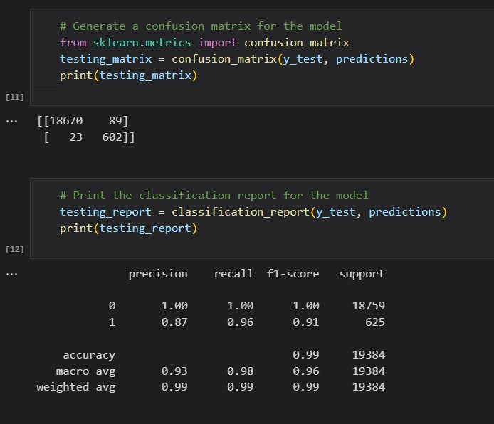
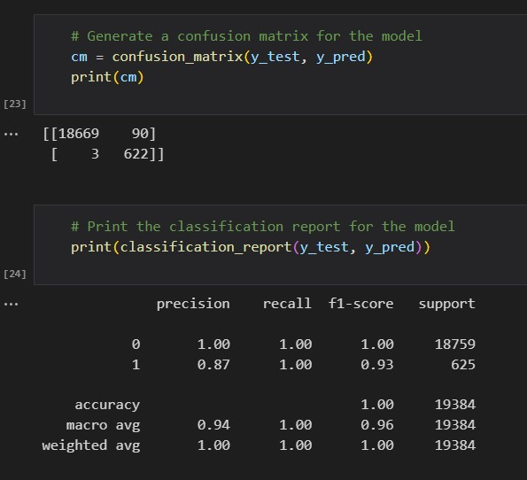

# Challenge20-Credit_Risk_Classification
Credit Risk Classification - Challenge 20

# Credit Risk Analysis
Supervised Machine Learning and Credit Risk

## Overview of the loan prediction risk analysis:   
Credit risk is an inherently unbalanced classification problem, as good loans easily outnumber risky loans. Different techniques were used to train and evaluate models with unbalanced classes. Various libraries and algorithms were used to build and evaluate models using resampling including: 
* imbalanced-learn RandomOverSampler
* scikit-learn Logistic Regression Model

## Purpose: 
* Explaination on machine learning algorithm use in data analytics.
* Create training, test groups, and split from a given data set.
* Implement the logistic regression machine learning algorithms to determine the performance of resampling of the dataset.
* Compare the advantages and disadvantages of each supervised learning algorithm.
* Determine with method is the best supervised learning algorithm for the given scenario.

## Results:
The results for the machine learning models including their respective balanced accuracy, precision, and recall scores are as follows:      

### Naive Data
     
1. Counter: Low Risk 75,036 / High Risk 2,500
2. Logistic Regression (Random State = 1)
3. Balanced Accuracy: 0.9942220387948824
4. Precision: The precision is high for High-risk loans and recall is very high for Low-risk loans.
5. Recall: Recision/Recall risk = .87/.96

### Random Oversampling
     
1. Counter: Low Risk 75,036 / High Risk 2,500
2. Logistic Regression (Random State = 1)
3. Balanced Accuracy:0.9952011514473053
4. Precision: The precision is high for High-risk loans and recall improved to near perfect for Low-risk loans.
5. Recall: High/Low risk = .87/1.00

## Summary:
When working with balanced accuracy, the highest compared accuracy between 0 and 1 and is closest to 1 is the best machine learning model.  
* Credit Card Data Set
  * For the credit card data set, the Random oversampling model is the best model to choose with its reduced false positive rate.  
  * The other models were below .80 balanced accuracy.  
* The precision for all models were similar and within an appropriate range.  The recall score also needs to fall within 0 and 1, with numbers closer to 1 being the better model.  
* The Easy Ensemble AdaBoost Classifier had the highest recall score, making it the final best machine learning model to choose for further credit card analysis.   
